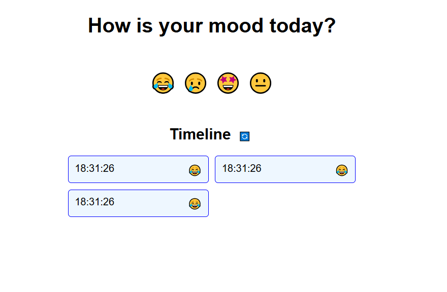

# Application features
 
- User can track mood - although on day basis for now. Could not get time to complete weekly and monthly timeline.
- User can view mood name by hovering over the mood
- Mood Records stored in Local Storage
- Reset Button to reset the timeline
- Timeline is in minutes only - sorry

# Screenshots

# Deployment link
https://lakshaysharma99.github.io/mood_trackers/

## Note
I know that I could not complete this project fully. I got busy in my company work. So I could not complete.